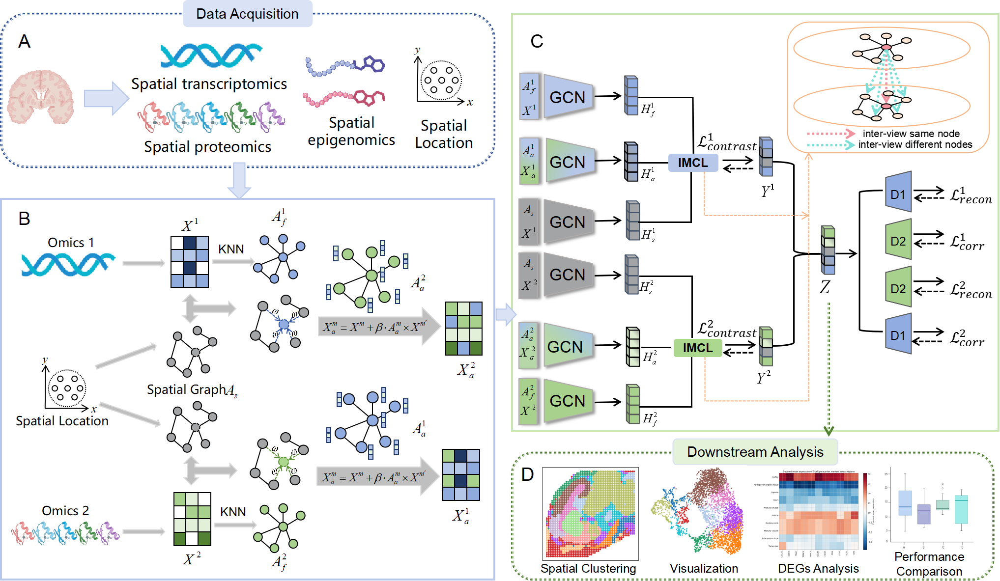

# A Cross-Modal Multi-View Contrastive Learning Framework for Spatial Multi-Omics Integration

# Installation & Dependencies
You'll need to install the following packages in order to run the codes.

* python==3.8
* torch>=1.8.0
* cudnn>=10.2
* numpy==1.22.3
* scanpy==1.9.1
* anndata==0.8.0
* rpy2==3.4.1
* pandas==1.4.2
* scipy==1.8.1
* scikit-learn==1.1.1
* scikit-misc==0.2.0
* tqdm==4.64.0
* matplotlib==3.4.2
* R==4.0.3

# Tutorial
For the step-by-step tutorial, please refer to:(https://github.com/baizijiabai-gif/MICA/tree/main/Tutorial)

## Data
